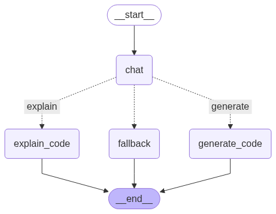
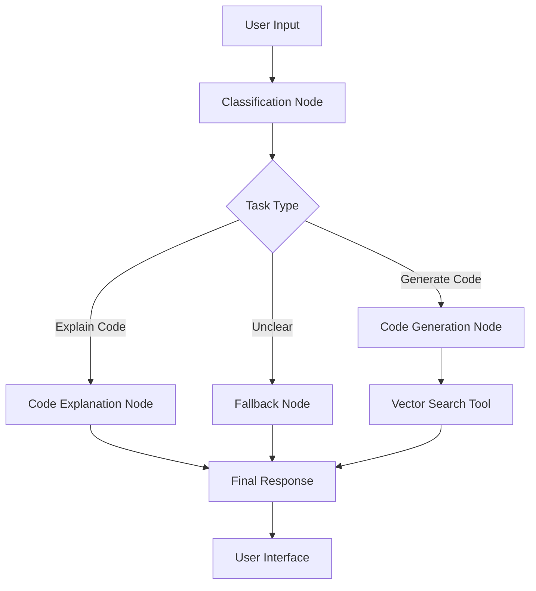

# 🤖 Smart Code Assistant

An intelligent code assistant that can generate, explain, and analyze code using advanced AI models. Built with LangChain, LangGraph, and deployed with Gradio.



## 🚀 Features

- **Code Generation**: Generate code based on natural language descriptions
- **Code Explanation**: Get detailed explanations of existing code
- **Code Analysis**: Analyze code for improvements and understanding
- **Interactive Web Interface**: User-friendly Gradio interface
- **Intelligent Task Classification**: Automatically determines the type of request
- **Vector Database Integration**: Uses ChromaDB for efficient code retrieval

## 🏗️ Architecture

### LangGraph Workflow



The assistant uses a conditional graph that:
1. **Classifies** the user's input (generate, explain, or unclear)
2. **Routes** to appropriate specialized nodes
3. **Retrieves** relevant code examples from vector database
4. **Generates** contextual responses using AI models

## 📁 Project Structure

```
Code-Assistant/
├── app.py                    # Main Gradio application
├── requirements.txt          # Python dependencies
├── smart_assistant.png       # Project image
├── agents/
│   ├── nodes.py             # LangGraph nodes implementation
│   └── state.py             # Graph state management
├── chroma_code_db/          # Vector database storage
├── config/
│   └── settings.py          # Configuration settings
├── graph/
│   └── conditional_graph.py # LangGraph workflow definition
├── prompts/
│   └── prompts.py           # AI prompts and templates
├── tools/
│   └── tools.py             # Custom tools and utilities
├── utils/
│   └── code_splitter.py     # Code parsing utilities
└── vectorstore/
    ├── builder.py           # Vector database builder
    └── retriever.py         # Document retrieval logic
```

## 🛠️ Installation & Setup

### Prerequisites

- Python 3.8+
- Ollama (for local AI models)

### Local Installation

1. **Clone the repository:**
   ```bash
   git clone https://github.com/yourusername/Code-Assistant.git
   cd Code-Assistant
   ```

2. **Install dependencies:**
   ```bash
   pip install -r requirements.txt
   ```

3. **Set up Ollama:**
   ```bash
   # Install Ollama (visit ollama.ai for installation instructions)
   # Pull your preferred model
   ollama pull llama2  # or your preferred model
   ```

4. **Configure settings:**
   - Edit `config/settings.py` to set your preferred model and parameters
   - The vector database will be built automatically on first run

5. **Run the application:**
   ```bash
   python app.py
   ```

6. **Open your browser:**
   - Navigate to `http://localhost:7860`
   - Enter your name to start the assistant

## 🌐 Online Demo

Try the live demo on Hugging Face Spaces:

**🔗 [Code Assistant - Live Demo](https://huggingface.co/spaces/Shrook21/Code-Assistant)**

No installation required - just open the link and start using the assistant!

## 📖 Usage

### Getting Started

1. **Enter your name** when prompted
2. **Ask questions** about code in natural language:
   - "Generate a function to sort a list in Python"
   - "Explain how bubble sort works"
   - "Create a REST API endpoint for user login"

### Example Interactions

```
👤 User: "Create a function that finds the maximum number in a list"

🤖 Assistant: 
🔍 Task Classification: GENERATE CODE

def find_maximum(numbers):
    """
    Find the maximum number in a list.
    
    Args:
        numbers (list): List of numbers
        
    Returns:
        int/float: Maximum number in the list
    """
    if not numbers:
        raise ValueError("List cannot be empty")
    
    max_num = numbers[0]
    for num in numbers[1:]:
        if num > max_num:
            max_num = num
    
    return max_num

# Example usage:
my_list = [3, 1, 4, 1, 5, 9, 2, 6]
result = find_maximum(my_list)
print(f"Maximum number: {result}")  # Output: Maximum number: 9
```


## 🧪 Development

### Adding New Features

1. **Custom Nodes**: Add new processing nodes in `agents/nodes.py`
2. **Tools**: Extend functionality in `tools/tools.py`
3. **Prompts**: Customize AI behavior in `prompts/prompts.py`
4. **Graph Logic**: Modify workflow in `graph/conditional_graph.py`

### Testing Locally

```bash
# Run with debug mode
python app.py --debug

# Test individual components
python -m vectorstore.builder  # Build vector database
python -m agents.nodes         # Test individual nodes
```

## 🤝 Contributing

1. Fork the repository
2. Create a feature branch (`git checkout -b feature/amazing-feature`)
3. Commit your changes (`git commit -m 'Add amazing feature'`)
4. Push to the branch (`git push origin feature/amazing-feature`)
5. Open a Pull Request

## 📝 License

This project is licensed under the MIT License - see the [LICENSE](LICENSE) file for details.

## 🙏 Acknowledgments

- **LangChain** - For the AI framework
- **LangGraph** - For workflow orchestration
- **Gradio** - For the web interface
- **Ollama** - For local AI model serving
- **ChromaDB** - For vector database functionality
- **Hugging Face** - For model hosting and deployment


⭐ **Star this repository if you find it helpful!**
